# ScholarChain — Activity Diagram

> A Mermaid.js activity (flowchart) diagram illustrating the complete end-to-end user workflows across all five increments. Two primary actors are modeled: the **Admin** and the **Scholar (Student)**.

---

## Master Activity Flow — All Increments

```mermaid
flowchart TD
    START([🚀 System Start]) --> INC1_START

    %% ─────────── INCREMENT 1: THE PLUMBING ───────────
    subgraph INC1["INCREMENT 1 — The Plumbing"]
        INC1_START["Admin opens web application"] --> CONNECT_WALLET
        CONNECT_WALLET["Admin clicks 'Connect Wallet'"] --> WALLET_POPUP
        WALLET_POPUP["Browser wallet extension\npops up for permission"] --> WALLET_APPROVE
        WALLET_APPROVE{Admin approves\nconnection?}
        WALLET_APPROVE -- "No" --> CONNECT_WALLET
        WALLET_APPROVE -- "Yes" --> WALLET_CONNECTED
        WALLET_CONNECTED["Wallet address + ADA balance\ndisplayed in header"]
        WALLET_CONNECTED --> FILL_FORM
        FILL_FORM["Admin fills Send form:\n• Recipient Address\n• ADA Amount"] --> CLICK_SEND
        CLICK_SEND["Admin clicks 'Send Scholarship'"] --> LOVELACE_CONVERT
        LOVELACE_CONVERT["System multiplies ADA × 1,000,000\n→ Lovelace value computed"] --> BUILD_TX
        BUILD_TX["MeshJS builds\nunsigned transaction"] --> SIGN_PROMPT
        SIGN_PROMPT["Admin wallet pops up\nshowing transaction details"] --> ADMIN_SIGNS
        ADMIN_SIGNS{Admin enters\nspending password\nand signs?}
        ADMIN_SIGNS -- "No / Closes popup" --> TX_REJECTED["Error: 'Transaction Cancelled'\ndisplayed to Admin"]
        ADMIN_SIGNS -- "Yes" --> TX_SUBMIT
        TX_SUBMIT["Signed transaction submitted\nto Cardano Preprod Testnet"] --> MEMPOOL_WAIT
        MEMPOOL_WAIT["UI shows 'Processing…' spinner\n(~20 second block time)"] --> TX_CONFIRMED
        TX_CONFIRMED["TxHash returned by network"] --> SHOW_TXHASH
        SHOW_TXHASH["'Scholarship Sent Successfully!'\nTxHash displayed as clickable link\n→ Cardanoscan explorer"]
    end

    %% ─────────── INCREMENT 2: DUAL REGISTRY ───────────
    SHOW_TXHASH --> INC2_SCHOLAR

    subgraph INC2["INCREMENT 2 — The Dual Registry"]
        INC2_SCHOLAR["Student visits /apply"] --> APP_FORM
        APP_FORM["Student fills application:\n• Name\n• Course\n• Cardano Wallet Address"] --> APP_SUBMIT
        APP_SUBMIT["Student clicks 'Submit Application'"] --> FIREBASE_WRITE
        FIREBASE_WRITE["New Scholar document written\nto Firestore\nstatus: 'Pending'"]

        INC2_SPONSOR["Sponsor visits /sponsor-entry"] --> SPO_FORM
        SPO_FORM["Sponsor fills form:\n• Sponsor Name\n• Pledge Amount (ADA)"] --> SPO_SUBMIT
        SPO_SUBMIT["Sponsor clicks 'Submit Pledge'"] --> SPO_FIREBASE
        SPO_FIREBASE["New Sponsor document\nwritten to Firestore"]

        FIREBASE_WRITE --> ADMIN_DASHBOARD
        SPO_FIREBASE --> ADMIN_DASHBOARD
        ADMIN_DASHBOARD["Admin Dashboard loads\nuseEffect fetches Scholars\nwhere status == 'Approved'"] --> RENDER_TABLE
        RENDER_TABLE["Scholars rendered as\ndynamic table rows"] --> ADMIN_CLICKS_SEND
        ADMIN_CLICKS_SEND["Admin clicks 'Send ADA'\nnext to a specific Scholar row"] --> FETCH_WALLET_ADDR
        FETCH_WALLET_ADDR["Scholar's WalletAddress\nautomatically passed from\nFirebase row → MeshJS"] --> BUILD_TX2
        BUILD_TX2["MeshJS builds ADA transaction\nusing dynamic wallet address"] --> SIGN_PROMPT
        BUILD_TX2 --> AFTER_TX_INC2
        AFTER_TX_INC2["On TxHash confirmed:\nFirestore Scholar doc updated\nLastPaidTxHash = txHash"]
    end

    %% ─────────── INCREMENT 3: DIGITAL BADGE ───────────
    AFTER_TX_INC2 --> INC3_START

    subgraph INC3["INCREMENT 3 — The Digital Badge"]
        INC3_START["Admin views Scholars\nwith status 'Pending'"] --> CLICK_MINT
        CLICK_MINT["Admin clicks 'Mint Scholar ID'\nnext to Pending scholar"] --> BUILD_META
        BUILD_META["System pulls Scholar Name + Course\nfrom Firebase → builds CIP-25\nNFT metadata object\n(includes IPFS image URI)"] --> FORGE_POLICY
        FORGE_POLICY["MeshJS ForgeScript generates\nunique University Policy ID"] --> MINT_TX
        MINT_TX["MeshJS builds mint transaction:\n• 1 NFT\n• Dynamic metadata\n• Destination = Scholar WalletAddress"] --> SIGN_PROMPT
        MINT_TX --> MINT_CONFIRMED
        MINT_CONFIRMED["NFT minted and sent\nto Scholar's wallet\nOn TxHash confirmed:"]
        MINT_CONFIRMED --> UPDATE_STATUS
        UPDATE_STATUS["Firestore Scholar updated:\n• status → 'Approved'\n• policyId saved"]

        UPDATE_STATUS --> SCHOLAR_LOGIN
        SCHOLAR_LOGIN["Scholar visits /scholar-portal"] --> CONNECT_SCHOLAR_WALLET
        CONNECT_SCHOLAR_WALLET["Scholar connects\ntheir Cardano wallet"] --> SCAN_ASSETS
        SCAN_ASSETS["wallet.getAssets() called\nreturns all wallet tokens/NFTs"] --> CHECK_POLICY
        CHECK_POLICY{NFT with University\nPolicy ID found\nin wallet?}
        CHECK_POLICY -- "No" --> ACCESS_DENIED["❌ 'Access Denied:\nValid Scholar NFT Not Found'"]
        CHECK_POLICY -- "Yes" --> ACCESS_GRANTED["✅ isAuthorized = true\nScholar Dashboard rendered\n(ADA balance, course, profile)"]
    end

    %% ─────────── INCREMENT 4: INCENTIVE ENGINE ───────────
    ACCESS_GRANTED --> INC4_START

    subgraph INC4["INCREMENT 4 — The Incentive Engine"]
        INC4_START["Admin visits Treasury tab"] --> MINT_SUPPLY
        MINT_SUPPLY["Admin enters Token Supply Amount\n(e.g. 10,000 SCHOLAR)"] --> CLICK_MINT_TOKENS
        CLICK_MINT_TOKENS["Admin clicks 'Mint Reward Supply'"] --> FORGE_TOKEN_POLICY
        FORGE_TOKEN_POLICY["MeshJS creates new Policy ID\n(separate from NFT policy)"] --> MINT_TOKENS_TX
        MINT_TOKENS_TX["MeshJS mints fungible tokens\ninto Admin's wallet"] --> SIGN_PROMPT
        MINT_TOKENS_TX --> TOKENS_MINTED
        TOKENS_MINTED["SCHOLAR tokens now in\nAdmin's treasury wallet"]

        SCHOLAR_SUBMITS["Scholar (in /scholar-portal)\nsubmits achievement:\n• Subject\n• Grade\n• Proof Link"] --> FIREBASE_ACHIEVEMENT
        FIREBASE_ACHIEVEMENT["Firebase Scholar doc updated:\nAchievement added\nrewardStatus: 'Pending Review'"]

        FIREBASE_ACHIEVEMENT --> ADMIN_REWARDS_TABLE
        ADMIN_REWARDS_TABLE["Admin views 'Pending Rewards' table\nFetched from Firestore"] --> ADMIN_INPUT_REWARD
        ADMIN_INPUT_REWARD["Admin inputs:\n• ADA Amount (e.g. 50)\n• Token Amount (e.g. 200 SCHOLAR)"] --> CLICK_APPROVE_SEND
        CLICK_APPROVE_SEND["Admin clicks 'Approve & Send Reward'"] --> BUILD_MULTI_TX
        BUILD_MULTI_TX["MeshJS sendAssets() called:\nBundles ADA + SCHOLAR tokens\ninto ONE transaction"] --> SIGN_PROMPT
        BUILD_MULTI_TX --> MULTI_TX_CONFIRMED
        MULTI_TX_CONFIRMED["Both ADA + Tokens delivered\nto Scholar in single transaction\nFirestore updated: rewardStatus → 'Paid'"]
    end

    %% ─────────── INCREMENT 5: GLASS HOUSE ───────────
    MULTI_TX_CONFIRMED --> INC5_START

    subgraph INC5["INCREMENT 5 — The Glass House"]
        INC5_START["Public user visits /transparency"] --> PARALLEL_FETCH
        PARALLEL_FETCH["useEffect triggers\ntwo simultaneous fetches"]

        PARALLEL_FETCH --> FETCH_PLEDGE
        PARALLEL_FETCH --> FETCH_BALANCE

        FETCH_PLEDGE["Firebase query:\nSUM of all Sponsor.pledgedAmount"] --> PLEDGE_RESULT
        PLEDGE_RESULT["Total Pledged: X ADA"]

        FETCH_BALANCE["HTTP GET /api/treasury\n(Next.js API Route)"] --> API_BLOCKFROST
        API_BLOCKFROST["Blockfrost: addresses(adminAddr)\nreturns live UTxO balance"] --> BALANCE_RESULT
        BALANCE_RESULT["Live Treasury Balance: Y ADA"]

        PLEDGE_RESULT --> COMPARE
        BALANCE_RESULT --> COMPARE
        COMPARE["Discrepancy computed:\nPledged X − (Balance Y + PaidOut Z)"] --> RENDER_SCOREBOARD
        RENDER_SCOREBOARD["Two stat cards rendered:\n'Total Pledged' vs 'Live Balance'\nDiscrepancy highlighted if gap > 0"]

        RENDER_SCOREBOARD --> FETCH_TX_HISTORY
        FETCH_TX_HISTORY["HTTP GET /api/transactions\n→ Blockfrost addressesTransactions()"] --> MAP_TX
        MAP_TX["Transaction list mapped:\nDate | Amount (ADA) | Recipient"] --> CROSS_REF
        CROSS_REF["Recipient addresses cross-referenced\nwith Firebase Scholars\nDisplay scholar name instead of raw address"] --> RENDER_LEDGER
        RENDER_LEDGER["Paginated Ledger Table rendered\nwith clickable TxHash links\n→ Cardanoscan for independent verification"]
    end

    RENDER_LEDGER --> END_STATE([✅ Full System Operational])

    %% Styling
    classDef inc1 fill:#1e3a5f,stroke:#4a90d9,color:#fff
    classDef inc2 fill:#2d4a1e,stroke:#6abf40,color:#fff
    classDef inc3 fill:#4a2d1e,stroke:#e67e22,color:#fff
    classDef inc4 fill:#3a1e4a,stroke:#9b59b6,color:#fff
    classDef inc5 fill:#1e4a3a,stroke:#1abc9c,color:#fff
    classDef terminal fill:#2c2c2c,stroke:#888,color:#fff

    class INC1_START,CONNECT_WALLET,WALLET_POPUP,WALLET_APPROVE,WALLET_CONNECTED,FILL_FORM,CLICK_SEND,LOVELACE_CONVERT,BUILD_TX,SIGN_PROMPT,ADMIN_SIGNS,TX_SUBMIT,MEMPOOL_WAIT,TX_CONFIRMED,SHOW_TXHASH,TX_REJECTED inc1
    class INC2_SCHOLAR,APP_FORM,APP_SUBMIT,FIREBASE_WRITE,INC2_SPONSOR,SPO_FORM,SPO_SUBMIT,SPO_FIREBASE,ADMIN_DASHBOARD,RENDER_TABLE,ADMIN_CLICKS_SEND,FETCH_WALLET_ADDR,BUILD_TX2,AFTER_TX_INC2 inc2
    class INC3_START,CLICK_MINT,BUILD_META,FORGE_POLICY,MINT_TX,MINT_CONFIRMED,UPDATE_STATUS,SCHOLAR_LOGIN,CONNECT_SCHOLAR_WALLET,SCAN_ASSETS,CHECK_POLICY,ACCESS_DENIED,ACCESS_GRANTED inc3
    class INC4_START,MINT_SUPPLY,CLICK_MINT_TOKENS,FORGE_TOKEN_POLICY,MINT_TOKENS_TX,TOKENS_MINTED,SCHOLAR_SUBMITS,FIREBASE_ACHIEVEMENT,ADMIN_REWARDS_TABLE,ADMIN_INPUT_REWARD,CLICK_APPROVE_SEND,BUILD_MULTI_TX,MULTI_TX_CONFIRMED inc4
    class INC5_START,PARALLEL_FETCH,FETCH_PLEDGE,FETCH_BALANCE,API_BLOCKFROST,PLEDGE_RESULT,BALANCE_RESULT,COMPARE,RENDER_SCOREBOARD,FETCH_TX_HISTORY,MAP_TX,CROSS_REF,RENDER_LEDGER inc5
    class START,END_STATE terminal
```

---

## Swimlane Summary

| Actor | Primary Actions |
|---|---|
| **Admin** | Connect wallet → Fill form → Sign transactions → Mint NFTs → Approve rewards → Manage treasury |
| **Student / Scholar** | Submit application → Connect wallet → Access Scholar Portal (NFT-gated) → Submit achievements |
| **Sponsor** | Submit pledge via Sponsor Entry form |
| **Public** | View Transparency Dashboard (read-only, no wallet required) |
| **System (MeshJS)** | Build transactions, run ForgeScript, scan wallet assets |
| **System (Firebase)** | Persist off-chain state, serve data to dashboard |
| **System (Blockfrost)** | Provide live on-chain balance and history (server-side) |
