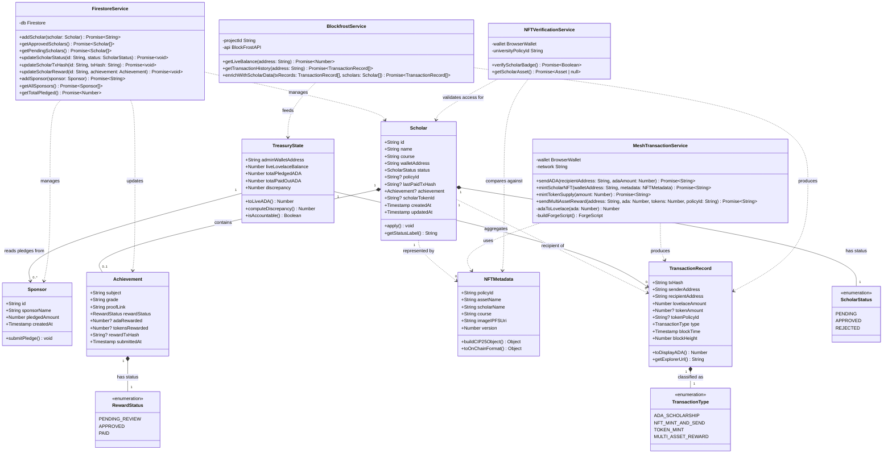

# ScholarChain — Class Diagram

> A Mermaid.js class diagram representing the core data structures, domain models, and their relationships across all five increments of ScholarChain.

---

---

## Class Descriptions

### Domain Entities

| Class | Layer | Description |
|---|---|---|
| `Scholar` | Off-chain (Firestore) | Represents a student applicant and their full lifecycle from `PENDING` application through `APPROVED` scholarship receipt and token `PAID` reward. |
| `Sponsor` | Off-chain (Firestore) | Records an institutional or private pledge amount used by the Transparency Dashboard for the accountability comparison. |
| `Achievement` | Off-chain (Firestore, embedded) | A sub-document within Scholar. Captures the student's academic submission and the reward payment status. |
| `NFTMetadata` | On-chain (Cardano, CIP-25) | The structured data baked into the Scholar Badge NFT at mint time. Contains the student's name, course, and IPFS image URI. |
| `TransactionRecord` | On-chain (read via Blockfrost) | Represents a single submitted transaction on the Cardano ledger. Used in the Transparency Dashboard ledger table. |
| `TreasuryState` | Computed (Firebase + Blockfrost) | A derived view model that combines off-chain pledge data with live on-chain balance to compute the accountability discrepancy. |

### Service Classes

| Class | Wraps | Key Responsibility |
|---|---|---|
| `MeshTransactionService` | MeshJS (`@meshsdk/core`) | Encapsulates all blockchain write operations — ADA transfers, NFT minting, token distribution. |
| `FirestoreService` | Firebase SDK | All CRUD operations for Scholar and Sponsor collections. |
| `BlockfrostService` | `@blockfrost/blockfrost-js` | Server-side reads of live blockchain data — balances and transaction histories. |
| `NFTVerificationService` | MeshJS `wallet.getAssets()` | Client-side logic for gating Scholar Portal access via Policy ID ownership check. |
