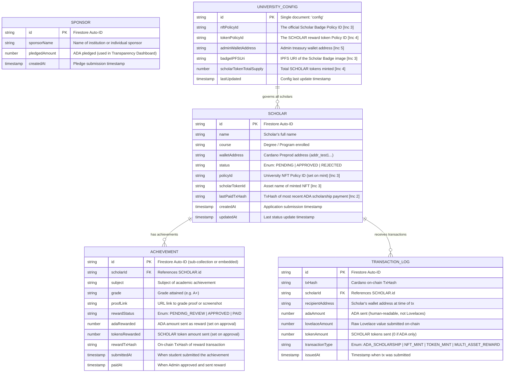

# ScholarChain — Entity-Relationship Diagram (ERD)

> A Mermaid.js ERD representing the off-chain Firebase Firestore data model used from Increment 2 onward. Relationships reflect how documents and sub-documents are structured in a NoSQL context.

---



---

## Entity Notes

### `SCHOLAR`
The central entity. Created when a student submits via `/apply` with `status: "PENDING"`. Updated throughout all increments:
- **Increment 2:** `lastPaidTxHash` added after ADA is sent.
- **Increment 3:** `policyId` and `scholarTokenId` added after NFT is minted; `status` flipped to `"APPROVED"`.
- **Increment 4:** Updated via the `ACHIEVEMENT` sub-document when a reward is paid.

### `ACHIEVEMENT`
Can be modeled as either:
- An **embedded sub-document** directly inside the Scholar document (simpler, Firestore-idiomatic for a single achievement per semester).
- A **sub-collection** (`scholars/{id}/achievements/`) if multiple achievements per scholar per year are needed.

The PDF describes one active achievement at a time, so the embedded approach is recommended for the MVP.

### `SPONSOR`
Write-once document. Read in aggregate (sum of `pledgedAmount`) by the Transparency Dashboard in Increment 5. Never linked directly to a specific Scholar — sponsors fund the general treasury pool.

### `UNIVERSITY_CONFIG`
A **singleton document** (single record with a fixed `id = "config"`). Stores system-wide configuration set by the Admin during setup. Prevents hardcoding the Policy IDs and Admin wallet address in application code.

### `TRANSACTION_LOG`
An **audit log** entity written each time the Admin successfully sends ADA or a multi-asset reward. Provides an application-level ledger that can be cross-referenced with the Blockfrost on-chain data in Increment 5 for double-entry bookkeeping.

---

## Firestore Collection Structure

```
Firestore Database
│
├── scholars/                          (Collection)
│   ├── {scholarId}/                   (Document)
│   │   ├── name: "Jane Doe"
│   │   ├── course: "BS Computer Science"
│   │   ├── walletAddress: "addr_test1..."
│   │   ├── status: "APPROVED"
│   │   ├── policyId: "abc123policy..."
│   │   ├── lastPaidTxHash: "txhash123..."
│   │   └── achievement: { ... }       (Embedded sub-document)
│
├── sponsors/                          (Collection)
│   └── {sponsorId}/                   (Document)
│       ├── sponsorName: "XYZ Foundation"
│       └── pledgedAmount: 5000
│
├── transaction_log/                   (Collection)
│   └── {txId}/                        (Document)
│       ├── txHash: "on_chain_hash..."
│       ├── scholarId: "scholar_ref..."
│       └── adaAmount: 50
│
└── config/                            (Collection)
    └── config/                        (Singleton Document)
        ├── nftPolicyId: "..."
        ├── tokenPolicyId: "..."
        └── adminWalletAddress: "addr_test1..."
```
