```mermaid
graph TB
    subgraph BROWSER["🌐 Client Browser"]
        subgraph NEXTJS["Next.js / React Application"]
            UI["UI Components\n(React TSX)"]
            HOOKS["Custom Hooks\n(useScholarData, useWallet)"]
            LIB_MESH["lib/mesh/\n(sendAda, mintNFT,\nmintTokens, sendMultiAsset,\nverifyNFTOwnership)"]
            LIB_FB["lib/firebase/\n(config, scholars, sponsors)"]
        end

        subgraph MESHREACT["@meshsdk/react"]
            MESH_PROVIDER["MeshProvider"]
            CARDANO_WALLET["CardanoWallet Component"]
            USE_WALLET["useWallet() Hook"]
        end

        subgraph MESHCORE["@meshsdk/core"]
            TX_BUILDER["Transaction Builder"]
            FORGE_SCRIPT["ForgeScript\n(Policy ID Generator)"]
            GET_ASSETS["wallet.getAssets()\n(NFT Scanner)"]
            LOVELACE["Lovelace Utilities"]
        end

        WALLET_EXT["🔐 Browser Wallet Extension\n(Eternl / Nami)\nKey Storage + Signing"]
    end

    subgraph NEXTAPI["⚙️ Next.js API Routes (Server-Side)"]
        API_TREASURY["GET /api/treasury\n(Live ADA Balance)"]
        API_TX["GET /api/transactions\n(Tx History)"]
        BF_CLIENT["lib/blockfrost/client.ts\n(@blockfrost/blockfrost-js)"]
    end

    subgraph FIREBASE["🔥 Firebase Firestore (Off-Chain DB)"]
        COL_SCHOLARS["scholars/ collection\n(applications, statuses, TxHashes)"]
        COL_SPONSORS["sponsors/ collection\n(names, pledge amounts)"]
    end

    subgraph BLOCKFROST["📡 Blockfrost API (Blockchain Read Layer)"]
        BF_ADDR["addresses(adminAddr)\n→ Live ADA Balance"]
        BF_TX["addressesTransactions(adminAddr)\n→ Transaction History"]
    end

    subgraph CARDANO["⛓️ Cardano Preprod Testnet"]
        MEMPOOL["Transaction Mempool"]
        LEDGER["Immutable Ledger\n(UTxOs, NFTs, Tokens)"]
        EXPLORER["Cardanoscan Explorer\n(Verification)"]
    end

    %% UI to Hooks
    UI --> HOOKS
    UI --> LIB_MESH
    UI --> LIB_FB

    %% Hooks to Firebase
    HOOKS --> LIB_FB
    LIB_FB --> COL_SCHOLARS
    LIB_FB --> COL_SPONSORS

    %% MeshJS React
    UI --> MESH_PROVIDER
    UI --> CARDANO_WALLET
    HOOKS --> USE_WALLET

    %% MeshJS Core connections
    LIB_MESH --> TX_BUILDER
    LIB_MESH --> FORGE_SCRIPT
    LIB_MESH --> GET_ASSETS
    LIB_MESH --> LOVELACE
    TX_BUILDER --> WALLET_EXT
    FORGE_SCRIPT --> WALLET_EXT
    GET_ASSETS --> WALLET_EXT

    %% Wallet to Chain
    WALLET_EXT -->|"Signed Transaction"| MEMPOOL
    MEMPOOL --> LEDGER

    %% BFF API Routes
    UI -->|"HTTP GET /api/treasury"| API_TREASURY
    UI -->|"HTTP GET /api/transactions"| API_TX
    API_TREASURY --> BF_CLIENT
    API_TX --> BF_CLIENT
    BF_CLIENT --> BF_ADDR
    BF_CLIENT --> BF_TX
    BF_ADDR -->|"Reads"| LEDGER
    BF_TX -->|"Reads"| LEDGER

    %% Explorer
    UI -->|"Clickable TxHash Link"| EXPLORER
    EXPLORER -->|"Reads"| LEDGER

    %% Style
    classDef browser fill:#1e3a5f,stroke:#4a90d9,color:#fff
    classDef mesh fill:#2d4a1e,stroke:#6abf40,color:#fff
    classDef firebase fill:#7a3a00,stroke:#f5a623,color:#fff
    classDef blockfrost fill:#3a1a5f,stroke:#9b59b6,color:#fff
    classDef cardano fill:#1a3a2a,stroke:#27ae60,color:#fff
    classDef api fill:#3a2a00,stroke:#f39c12,color:#fff

    class UI,HOOKS,LIB_MESH,LIB_FB browser
    class MESH_PROVIDER,CARDANO_WALLET,USE_WALLET,TX_BUILDER,FORGE_SCRIPT,GET_ASSETS,LOVELACE mesh
    class COL_SCHOLARS,COL_SPONSORS firebase
    class BF_ADDR,BF_TX blockfrost
    class MEMPOOL,LEDGER,EXPLORER cardano
    class API_TREASURY,API_TX,BF_CLIENT api
```

# ScholarChain — Package Diagram

> A Mermaid.js diagram illustrating how the major packages and systems in ScholarChain interact with each other, organized by architectural layer.

---

---

## Diagram Notes

### Data Flow Summary

| Flow | Direction | Protocol |
|---|---|---|
| UI → Firebase | Read/Write Scholar & Sponsor data | Firebase SDK (WebSocket/HTTP) |
| UI → MeshJS | Build and sign transactions | In-browser JavaScript |
| MeshJS → Wallet Extension | Sign transaction (user approves) | Browser Extension API (CIP-30) |
| Wallet Extension → Cardano | Submit signed transaction | Cardano network protocol |
| UI → Next.js API Routes | Request blockchain data | HTTP GET (same-origin) |
| API Routes → Blockfrost | Fetch live balance & tx history | HTTPS REST API |
| Blockfrost → Cardano Ledger | Read indexed chain data | Blockfrost internal indexer |
| UI → Cardanoscan | Open TxHash in explorer (new tab) | Hyperlink (HTTPS) |

### CIP-30 — The Wallet API Standard
MeshJS communicates with browser wallet extensions via **CIP-30** (Cardano Improvement Proposal 30), the standardized dApp-to-wallet interface. This means ScholarChain works with **any** CIP-30 compliant wallet — Eternl, Nami, Flint, Typhon, etc. — without code changes.

### Why Blockfrost is Server-Side Only
Blockfrost requires a `PROJECT_ID` API key. If this key were placed in a client-side component, it would be visible in the browser bundle and could be stolen. Using a Next.js API route as a proxy ensures the key lives exclusively on the server.
